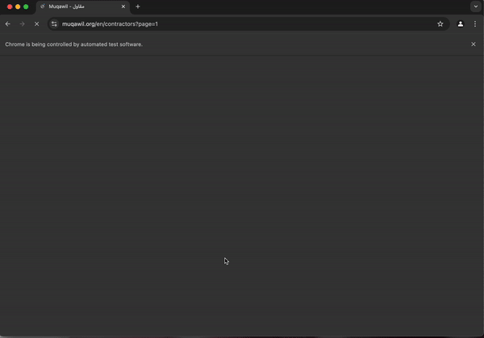

# web crawler

This project is a Python-based web crawler that collects data on contractors from the [Muqawil Contractors Directory](https://muqawil.org/en/contractors). The crawler uses Selenium to handle dynamically loaded content and BeautifulSoup to parse the HTML. 

Data collected includes:

1. Company Name
2. Membership Number
3. City
4. Activities

and the output is saved into an **Excel** file.

## Project Architecture
```bash
web_crawler
│
┣ 📜contractors.xlsx  # Excel file (output)
┣ 📜crawler.py        # Main crawler code
┣ 📜README.MD         # Instructions for setup, usage, and details
┗ 📜requirements.txt  # List of required dependencies
```

## Requirements

 In order to run the web, this project requires a Python SDK and Google Chrome.

1. install [Python SDK](https://www.python.org/downloads/)

2. install [Google Chrome](https://www.google.com/chrome/?brand=FKPE&ds_kid=43700078669631145&gclsrc=aw.ds&gad_source=1&gbraid=0AAAAADpV5HO_uc9-HIxj-ghzOpRdG24-j&gclid=CjwKCAiAgoq7BhBxEiwAVcW0LC-q_yWcfrWcPj0AWL3P9EEiWNb8WOyezexcjXsE-BzqvemJRSnYBhoCpGYQAvD_BwE)

## How to run the project

1. Open terminal or CMD.
2. Clone the Repository, such as 
```bash
git clone https://github.com/Amjad-elahi/Web_Crawler.git
```
3. Navigate to the project path, such as 
```bash
cd web-crawler
```
4. open the project in VS Code, such as 
```bash
code .
``` 
5. Install Dependencies with a command:
```bash
pip install -r requirements.txt
```
6. Run the web with a command: 
```bash
python crawler.py
```

## Challenges Faced

1. Pagination Handling

**Challenge**: Navigating multiple pages required appending the correct query parameter (?page=N) to the base URL.

**Solution**: Implemented a loop to dynamically construct URLs for each page based on the total number of pages to crawl.

2. Handling Missing Data

**Challenge**: Some contractor cards did not include specific fields like Activities.

**Solution**: Implemented conditional checks to handle missing fields and used "N/A" as a default placeholder.

3. Parsing Nested HTML

    - **Challenge**: Extracting nested elements like info-name, info-value, and list items required specific parsing logic.

    - **Solution**: Used BeautifulSoup's methods (find, select, find_all) to traverse and extract the required data efficiently.

## Sample run
To collect data, press the Contract Request button on each page. After processing 10 pages, an Excel file named (contractors.xlsx) will be generated

<p align="center">

<br/>

## Created by
[Amjad Elahi](https://github.com/Amjad-elahi)


